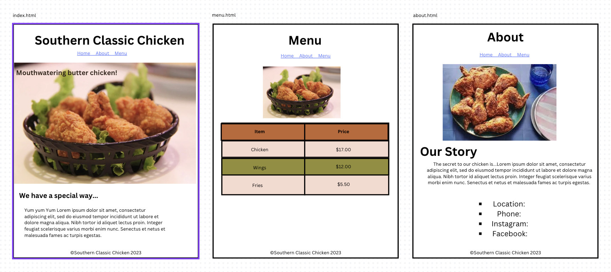

# Instructions  

## Introduction

Let's revisit the project from last time. You made a website for a restaurant in html. Now let's re-build it with CSS.

#### HTML Overview

First your will build your HTML. Please add all (most) HTML stucture before starting your CSS. It will make things go more smoothly if you keep your focus on one task at a time.

It is OK to re-use your pictures and text. But I highly recomend re-typing all the HTML out again, so you get more practice. See how much faster it goes this time! 

#### CSS Overview

Then start on your CSS.

The CSS Requirements are...

1. Style your table with a border and different colors for different rows.
2. Style your list with list-style-type.
3. Add a new picture on each page, and use CSS to style its size, padding, margin and/or border.
4. Make a hero element with a `background-image` and positioning.

## Detailed instructions

First, build your HTML again.

### HTML details

The HTML should look something like this.

1. Your website will need three pages. Home, About, and Menu.
2. *IMPORTANT*: Use the tags `header`, `nav`, `main`, `footer`, and `article` to make your page more accessible to screen readers.
3. The pages should all have links to each other.
4. Each page should have a photo relevant to the topic. *(Don't forget the `title` attribute!)*
5. Each page should have h1, h2 and p tags.
6. At least one page should have a table with at least 12 cells.
7. At least one page should have a list.

### CSS styling details

Once your HTML page is setup. Move on to the CSS.

The Styled page will look something like this:

1. Set the images to the sizes you want them to be using CSS.
2. Set the padding, margin, and border on the text and images.
3. Style the tables. The table should have three colors. One for the table header tags `th`, and two for the rows. The `td` and `th` tags should also have borders.
4. Set the links at the top to look like a Navigation Bar.
5. Style the list in your content with list-style-type. (Take care to use a CSS Selector that does not select the links in the Navagiation Bar!)
6. Set the footer to be centered, and the font smaller.

### Bonus

1. Choose a font-family for different parts of your page. Get creative!
2. Choose a background color, or gradient for the body of your page.
3. Style the header marque text to be padded against the sides of the page. And use [https://coolor.co](https://coolors.co/) to choose a `color` and `background-color` for your brand.
4. Style the links in your `nav` to look nice with borders, padding, and colors.
5. Get creative with CSS Selectors. (see: https://flukeout.github.io/)
6. Anthing else you can think of!